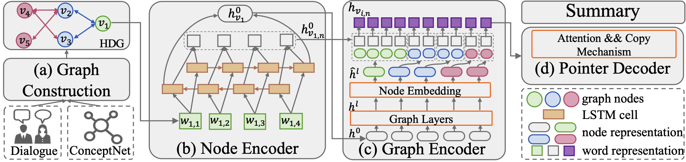

# DHGN

This is the **pytorch** code for our [CCL 2021](http://cips-cl.org/static/CCL2021/index.html) paper **Incorporating Commonsense Knowledge into Abstractive Dialogue Summarization via Heterogeneous Graph Networks** [[arXiv Preprint]](https://arxiv.org/abs/2010.10044).

<p align="center">
  
</p>

## Outputs
* Output summaries are available at [summaries/summary_rerank.txt](https://github.com/xcfcode/DHGN/blob/main/summaries/summary_rerank.txt).

## Requirements
* We use Conda python 3.7 and strongly recommend that you create a new environment: `conda create -n dhgn python=3.7`.
* Run the following command: `pip install -r requirements.txt`.
### * pytorch_geometric
* We use [pytorch_geometric](https://github.com/rusty1s/pytorch_geometric) for GNN implementation.
* Download `*.whl` files from https://pytorch-geometric.com/whl/torch-1.4.0.html
* Run following commands:
```
pip install torch_spline_conv-latest+cu100-cp37-cp37m-linux_x86_64.whl
pip install torch_cluster-latest+cu100-cp37-cp37m-linux_x86_64.whl
pip install torch_sparse-latest+cu100-cp37-cp37m-linux_x86_64.whl
pip install torch_scatter-latest+cu100-cp37-cp37m-linux_x86_64.whl
pip install torch-geometric==1.4.3
```

## Reproduce Results
You can follow the following steps to reproduce the best results in our paper.

### * download checkpoints
Download checkpoints [here](https://drive.google.com/drive/folders/1DY3ZS5_b4nTtWftkWYqgQ3Ip0LoQcfZc?usp=sharing). Put the checkpoint `samsum.pt` under the project dir **DHGN/models/samsum.pt**.

### * translate
We can get `summaries/summary.txt`
```
python translate.py \
-src data/test.src.txt \
-edge_index data/test.edge_index.txt \
-edge_type data/test.edge_type.txt \
-node_type data/test.node_type.txt \
-max_length 1000 -min_length 19 -beta 1 -ignore_when_blocking "." "," -stepwise_penalty -coverage_penalty summary -n_best 4 -batch_size 64 -beam_size 10 -dynamic_dict -share_vocab  -block_ngram_repeat 3 -replace_unk \
-model models/samsum.pt \
-output summaries/summary.txt \
-gpu X
```
### * rerank
* `python rerank.py -n 4 -c summaries/summary.txt`

### * test rouge score
* `python py_rouge_test.py -c summaries/summary_rerank.txt`
* Output `>>> ROUGE 1-2-L F: 42.03-18.07-39.56`


## From Scratch
### * preprocess
(1) Preprocess ICSI dataset.

```
python preprocess.py \
  -train_src data/train.src.txt \
  -train_edge_index data/train.edge_index.txt \
  -train_edge_type data/train.edge_type.txt \
  -train_node_type data/train.node_type.txt \
  -train_tgt data/train.tgt.txt \
  -valid_src data/valid.src.txt \
  -valid_edge_index data/valid.edge_index.txt \
  -valid_edge_type data/valid.edge_type.txt \
  -valid_node_type data/valid.node_type.txt \
  -valid_tgt data/valid.tgt.txt \
  -save_data data/samsum \
  -dynamic_dict \
  -share_vocab \
  -src_words_min_frequency 0 \
  -tgt_words_min_frequency 0 \
  -src_seq_length 10000 \
  -tgt_seq_length 10000 \
  -src_seq_length_trunc 10000 \
  -tgt_seq_length_trunc 10000 \
  -overwrite
```

(2) Create pre-trained word embeddings.

download `glove.6B.100d.txt` from [here](https://drive.google.com/drive/folders/1GDc-7rYnGczxbKSiQo0YFXeTfDvAU-16?usp=sharing).

```
python embeddings_to_torch.py -emb_file_both data/glove.6B.100d.txt \
-dict_file data/samsum.vocab.pt \
-output_file data/samsum_embeddings
```

### * train
```
CUDA_VISIBLE_DEVICES=x python train.py -config ./config/train.yml -save_config ./config/train.txt
CUDA_VISIBLE_DEVICES=x python train.py -config ./config/train.yml

```

### * translate
```
python translate.py \
-src data/test.src.txt \
-edge_index data/test.edge_index.txt \
-edge_type data/test.edge_type.txt \
-node_type data/test.node_type.txt \
-max_length 1000 -min_length 19 -beta 1 -ignore_when_blocking "." "," -stepwise_penalty -coverage_penalty summary -n_best 4 -batch_size 64 -beam_size 10 -dynamic_dict -share_vocab  -block_ngram_repeat 3 -replace_unk \
-model models/xxxx.pt \
-output summaries/xxxx.txt \
-gpu X
```

### * rerank
* `python rerank.py -n 4 -c summaries/xxxx.txt`

### * test rouge score
* `python py_rouge_test.py -c summaries/summary_rerank.txt`